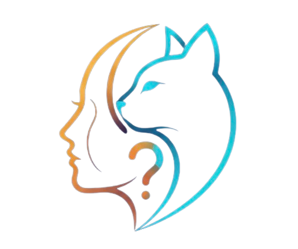

<div align="center">
  

# 🧠 DUALIS — AI HumanPets
**Descubre qué tipo de mascota tienes o qué persona ves**  
Plataforma interactiva donde una IA analiza imágenes de personas o animales y devuelve información divertida y estimaciones.
</div>

---

## ✨ ¿Qué hace DUALIS?

✔ Subes una imagen o eliges una miniatura de ejemplo  
✔ Seleccionas un modelo → **Humano** o **Mascota**  
✔ La IA predice y muestra sobre la imagen:

### Para Humanos:
- 👤 Género (Hombre / Mujer)
- 🎯 Estimación de edad
- 💬 Mensaje personalizado emocional

### Para Mascotas:
- 🐾 Especie (Perro / Gato)
- 💬 Mensaje cariñoso sobre la mascota

Además:

🔹 Historial de predicciones almacenado en localStorage (hasta 10 items)  
🔹 Animaciones UI: fading, hover reveal, image shrinking  
🔹 Galería en Home para pruebas rápidas con predicción automática  
🔹 El usuario controla qué imagen visualizar y puede eliminarla  

---

## 🏗️ Arquitectura

**Frontend**
    **Tecnologias:** Next.js 14 + React 19 + Tailwind CSS
        **Descripción:** Interfaz UI/UX limpia y moderna.
**Backend**
    **Tecnologias:** FastAPI (Python3)
        **Descripción:** Proporciona los modelos IA mediante una API REST.
**Modelos IA**
    **Tecnologias:** TensorFlow / Keras
        **Descripción:** Clasificación de género, edad y mascotas.
**DB**
    **Tecnologias:** MongoDB con Motor (async)
        **Descripción:** Guarda predicciones y sus resultados históricos.
**Estado**
    **Tecnologias:** localStorage + React Context
        **Descripción:** Mantiene historial y selección actual.

---

## 🚀 Ejecución del proyecto

### 🐍 Backend (FastAPI)

Requisitos:

```sh
pip install -r requirements.txt
```
Ejecutar:

```sh
uvicorn main:app --reload
```

API disponible en:

```sh
http://127.0.0.1:8000/
```
### 💻 Frontend (Next.js + Tailwind)

Instalar dependencias:

```sh
cd front-aihumanpets
npm install
```

Modo desarrollo:

```sh
npm run dev
```

Abrir en navegador:

```sh
http://localhost:3000
```

Asegúrate de tener NEXT_PUBLIC_API_URL configurado para apuntar al backend:

```env
NEXT_PUBLIC_API_URL=http://127.0.0.1:8000
```

---

## 🧩 Endpoints API (FastAPI)

**Metodo:** POST
    **Ruta:** /api/predict
        **Descripción:** Recibe una imagen y devuelve predicción.
**Metodo:** GET
    **Ruta:** /api/predict/all
        **Descripción:** Lista todas las predicciones guardadas.
**Metodo:** GET
    **Ruta:** /
        **Descripción:** Verrificar funcionamiento.

## 📌 Ejemplo respuesta:

```json
{
  "resultado": {
    "genero": "Observo una mujer",
    "edad_estimacion": "De edad entre 20 y 25 años",
    "mensaje": "¡Simplemente cautivadora!"
  }
}
```

## 🧠 Modelos IA

### Humano

Dataset: **UTKFace**
Salidas:
    Genero (0 Hombre/ 1 Mujer)
    Estimación de edad (rango)

### Mascota

Dataset: **cats_and_dogs_filtered**
Clasificacion:
    🐶 Dog
    🐱 Cat

## 🧩 Características UI

UploadBox con arrastrar y soltar

Visualización con overlay borroso + tipografía manuscrita (“Great Vibes”)

Galería con animaciones y scroll suave

Botones inteligentes (solo habilitan si todo está listo)

Responsive para móviles y escritorio

## 🧪 Pruebas recomendadas

Puedes probar con las miniaturas incluidas:

📁 public/samples/human
📁 public/samples/pets

# 🧑‍💻 Autor

Kouravi — Ingeniero
🔗 LinkedIn: https://linkedin.com/in/jdlod

🐙 GitHub: https://github.com/Kouravi/DUALIS

¡Gracias por usar DUALIS! 💙
La IA puede fallar. Verifica siempre datos importantes 🧠✨